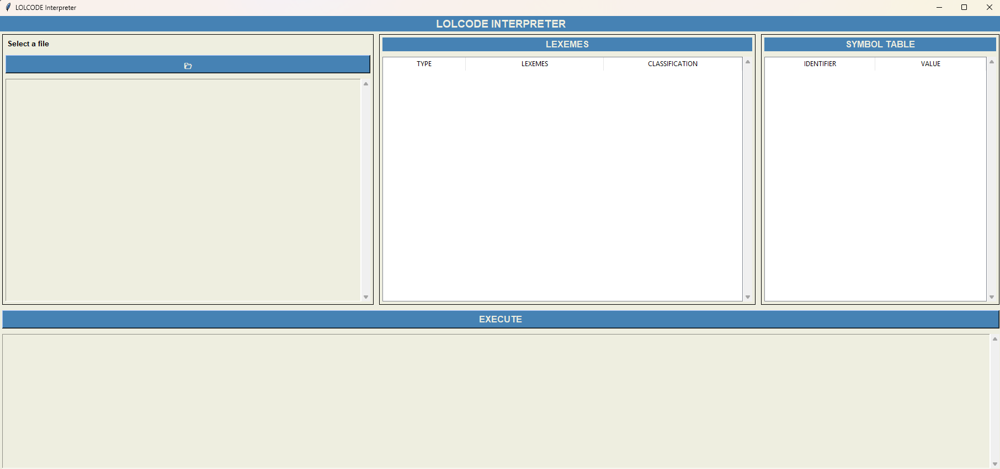

# CMSC 124 Final Project - LOLCode Interpreter using Python

## Description

An interpreter for the LOLCode Programming Language created using Python.

## Group 3

- Calixtro, Kurt Ivan
- Cueto, Adrian
- Pepito, Shane

## Installation Guide

### Prerequisites

- **Python 3.7** or above

  - installation link: https://www.python.org/downloads/
  - to check the current version
    - `python3 --version`
    - It should output at least `Python 3.7.x` for the code to work properly

- **Tkinter** - for UI of the application

  - Tkinter should be included after installing Python 3.7+, if not use `pip`
    - `pip3 install tkinter` or `pip3 install tk`

### Setup

1. Clone this repository
   ```
   git clone https://github.com/driee17/cmsc124-project.git
   ```
2. Open the 'source_code' folder of the repository in the terminal
   ```
   cd cmsc124-project/source_code
   ```
3. Run this code to start the program
   ```
   python3 main.py
   ```
4. This window should pop-up after running the program
   
5. You're good to go!

## Links

### Project Specifications

https://docs.google.com/document/d/1tF7LClE1CddXfyIIwvRWcUOavm4NGEb24Nx04PTIq9g/edit?tab=t.0

### Project Submission and Presentation Instructions

https://docs.google.com/document/d/1jZ0pNSgnT3VqROcARZIcQClIEnhB00NLpfAxQa0wLjM/edit?tab=t.0
